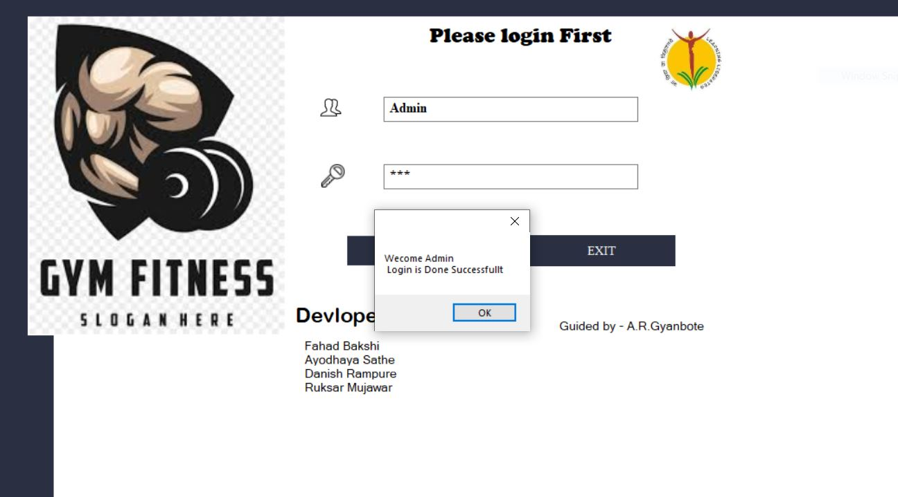
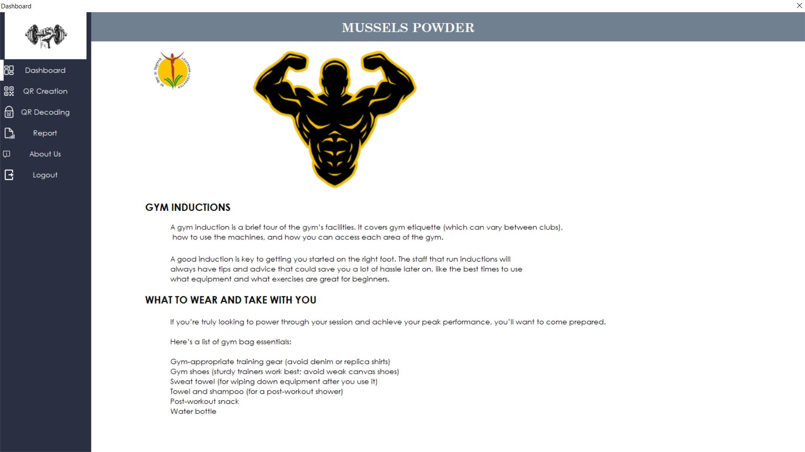
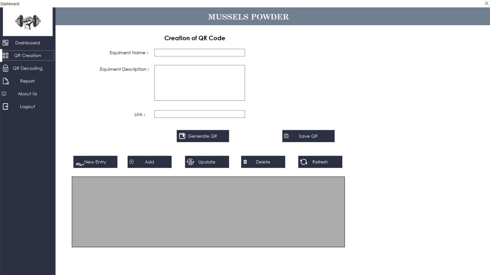
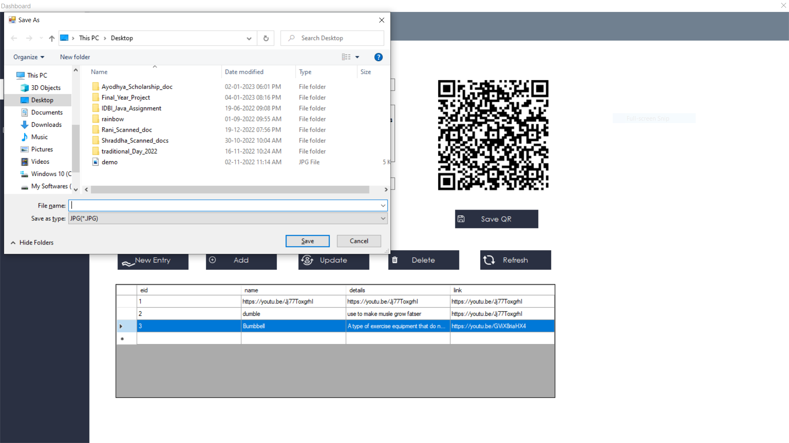
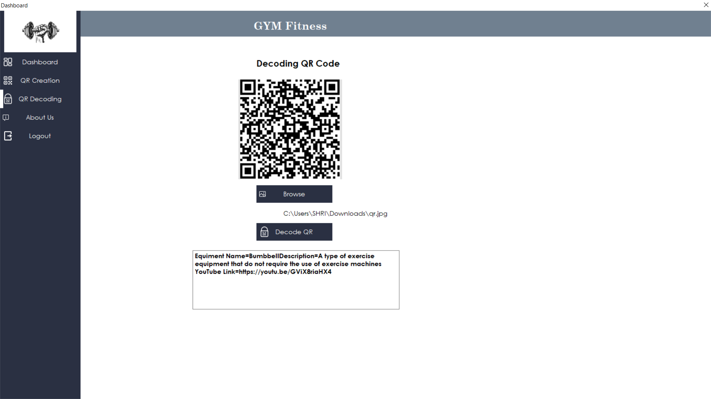
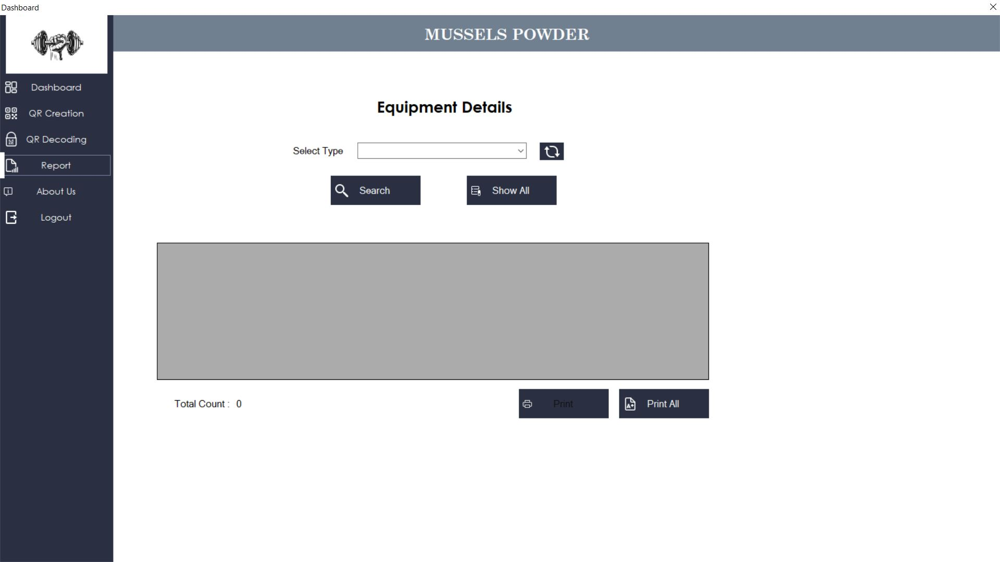

# QR-Code-Application-in-Advanced-Gym-Fitness
Gym Management System through Quick Response Code 

#Requirements:# 
1) VB .net 2010  
2) C sharp (c#)  
3) Microsoft SQL Server 2017  

#Informaiton About Project:# 
The main advantage of this software is less Manpower 
is used and the data transfer rate also increases and a lot of time is saved. The reasons to use QR 
codes are clear: to build direct connections with customers and collect the data 

<b>Login Page  
  
  
Home Page   
  
  

QR Creation Page   
  
  
Save QR Page   
  
  
QR Decode Page   
  
  
Equipment Details Page   
  

